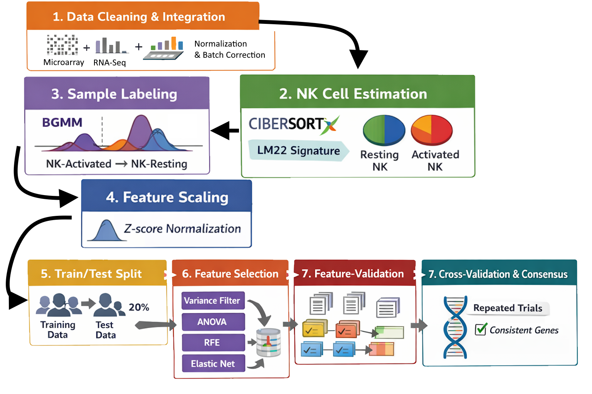

<h1 align="center">
  Machine Learning Based Identification of Key Regulators of NK Cell Dysfunction in Intrahepatic Cholangiocarcinoma
</h1>

  This repository contains supplemental resources for the research paper: Machine Learning Based Identification of Key Regulators of NK Cell Dysfunction in Intrahepatic Cholangiocarcinoma.

  Authors: Katelyn Deng, Austin Yu, Tony Zeng, and Ziliang Zong.

  

<h2>
  Abstract:
</h2>

  Intrahepatic cholangiocarcinoma (ICC) is a subtype of
primary liver cancer that originates from the bile ducts in
the liver, accounting for approximately 10% of all liver
malignancies. Although less common than hepatocellular
carcinoma (HCC), which accounts for 75–85% of primary
liver cancer, ICC remains a significant clinical challenge
due to its late diagnosis and aggressive progression. Currently,
the only curative treatment option for patients is surgical
resection; however, the prognosis is extremely poor, with a
five-year survival rate of below 10%. The remaining treat-
ment options are chemotherapy, radiation, and, most notably,
emerging forms of immunotherapy.

  A defining feature of ICC is its immunosuppressive microenvironment, 
where immune effector cells become functionally impaired — most notably, natural killer (NK) cells.
NK cells are innate cytotoxic lymphocytes
capable of recognizing and eliminating malignant cells independently of antigen presentation. A previous study has
reported that NK cells constitute a dominant immune population within the ICC tumor microenvironment, occupying
the largest immune compartment relative to other infiltrating
immune cells. 
The video below visually details the mechanics of NK cells and their role in tumor suppression-

Despite this presence, NK cells have been observed to be functionally impaired or exhausted, suggesting suppression rather than absence. 
This phenomenon, characterized by decreased cytokine production, reduced degranulation, and increased inhibitory markers, is largely driven by ICC's immunosuppressive tumor microenvironment (TME). 
However, the molecular mechanisms underlying this
dysfunction remain obscure. 

The TME of intrahepatic cholangiocarcinoma has been characterized as immunosuppressive,
with a prominent amount of tumor-associated macrophages
(TAMs), neutrophils, and regulatory T cells. Recent research
has demonstrated that tumor-associated neutrophils (TANs)
and TAMs interact to accelerate ICC progression by activating STAT3 signaling, therefore enhancing tumor invasion
and metastasis. Meanwhile, ICC-associated M2-polarized
TAMs can drive tumor growth and invasiveness through an
IL-10/STAT3-dependent epithelial-to-mesenchymal transition
(EMT). Elevated TAM infiltration has been shown to
correlate with worse prognosis. The video below illustrates the key components of the ICC tumor microenvironment 
and the intricate interactions that drive immune suppression-

  
  In this study, we analyzed two
ICC transcriptomic datasets from the Gene Expression Omnibus
using CIBERSORTx to quantify resting and activated NK cell
populations. We then applied machine learning approaches to
identify genes that are associated with these NK cell functional
states across both datasets. Genes were filtered through variance
thresholding, ANOVA F-tests, recursive feature elimination, and
elastic net regression, followed by repeated resampling to identify
consistently enriched candidates. This work establishes an in-silico approach for connecting gene-level expression patterns to
immune cell dysfunction in solid tumors, and contributes to
future studies aimed at restoring NK cell function in ICC.

  
<h2>
  Repository Contents:
</h2>
<ul>
  <li>
    <h3>Machine Learning</h3>
    
Relevant sources used or implemented during the machine learning process.

    <ul>
      <li><strong>Code:</strong> Contains implementations of algorithms and other relevant source code</li>
      <li><strong>Datasets:</strong> Contain datasets used to train the machine learning model</li>
    </ul>
  </li>

  <li>
    <h3>Media</h3>
    
Extra media (animations, images, diagrams) created to provide accessible visualizations for processes detailed in the research paper.

    <ul>
      <li><strong>Animations:</strong> Animations of underlying biological processes relevant to the research</li>
      <li><strong>Images:</strong> Images related to the findings of the research</li>
      <li><strong>Diagrams:</strong> Diagrams of processes relevant to the research</li>
    </ul>
  </li>
</ul>

<h2>
  Contacts:
</h2>
<ul>
  <li>
    Katelyn Deng:
    <ul>
      <li>
        Email: <a href="mailto:katelyndeng03@gmail.com">katelyndeng03@gmail.com</a>
      </li>
    </ul>
  </li>
  <li>
    Austin Yu:
    <ul>
      <li>
        Email: <a href="mailto:austinyu130@gmail.com">austinyu130@gmail.com</a>
      </li>
    </ul>
  </li>
  <li>
    Tony Zeng:
    <ul>
      <li>
        Email: <a href="mailto:zengtony08@gmail.com">zengtony08@gmail.com</a>
      </li>
    </ul>
  </li>
  <li>
    Ziliang Zong
    <ul>
      <li>
        Email: <a href="mailto:ziliang@txstate.edu">ziliang@txstate.edu</a>
      </li>
    </ul>
  </li>
</ul>

