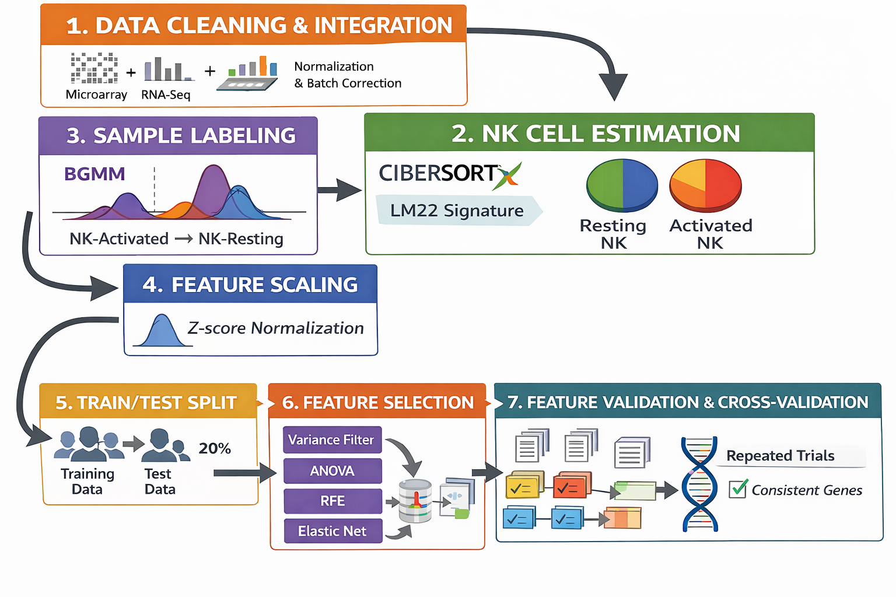
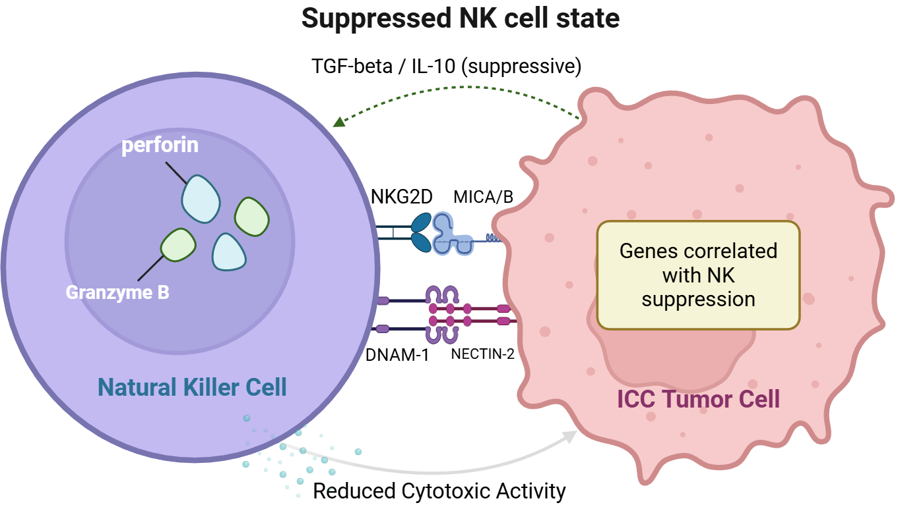
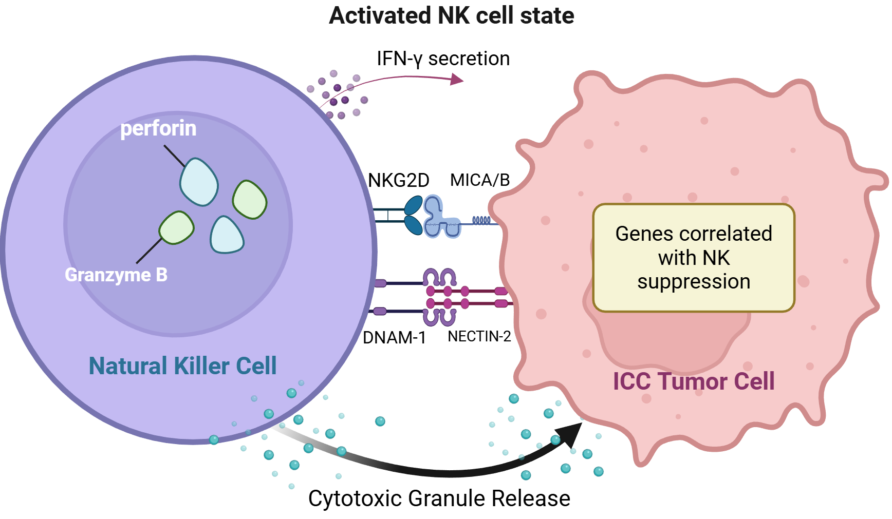
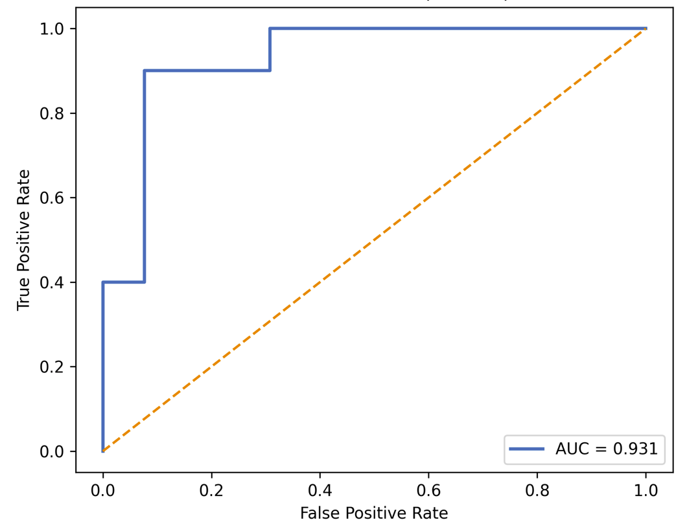
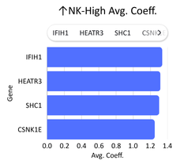
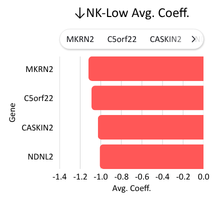

<h1 align="center">Machine Learning Based Identification of Key Regulators of NK Cell Dysfunction in Intrahepatic Cholangiocarcinoma</h1>




This repository contains supplemental resources for the research paper: Machine Learning Based Identification of Key Regulators of NK Cell Dysfunction in Intrahepatic Cholangiocarcinoma.

**Authors:** Katelyn Deng, Austin Yu, Tony Zeng, and Ziliang Zong.
## Overview

In intrahepatic cholangiocarcinoma (ICC), a cancer of the liver's bile ducts, certain immune cells show up in large numbers but lose much of their ability to fight the tumor. But what exactly causes these cells to become dysfunctional? We investigated this question by applying machine learning across two transcriptomic datasets and pinpointing the genes most closely tied to whether natural killer (NK) cells stay active or go dormant. These genes offer a starting point for future work aimed at reactivating NK cells in a cancer that remains very difficult to treat.

<table>
<tr>
<td align="center" width="50%">
<br><br>
<b>Suppressed NK Cell State in ICC</b><br>
Tumor-associated immunosuppressive signaling is associated with reduced NK cytotoxic activity, diminished granule release, and gene expression patterns correlated with NK suppression.
</td>

<td align="center" width="50%">
<br><br>
<b>Activated NK Cell State in ICC</b><br>
Enhanced receptor–ligand interactions are associated with increased cytotoxic granule release and interferon-gamma (IFN-γ) secretion, alongside gene expression patterns correlated with NK activation.
</td>
</tr>
</table>

## Introduction

Intrahepatic cholangiocarcinoma (ICC) is a subtype of primary liver cancer that originates from the bile ducts in the liver, accounting for approximately 10% of all liver malignancies. Although less common than hepatocellular carcinoma (HCC), which accounts for 75–85% of primary liver cancer, ICC remains a significant clinical challenge due to its late diagnosis and aggressive progression. Currently, the only curative treatment option for patients is surgical resection; however, the prognosis is extremely poor, with a five-year survival rate of below 10%. The remaining treatment options are chemotherapy, radiation, and, most notably, emerging forms of immunotherapy.

A defining feature of ICC is its immunosuppressive microenvironment, where immune effector cells become functionally impaired — most notably, natural killer (NK) cells. NK cells are innate cytotoxic lymphocytes capable of recognizing and eliminating malignant cells independently of antigen presentation. A previous study has reported that NK cells constitute a dominant immune population within the ICC tumor microenvironment, occupying the largest immune compartment relative to other infiltrating immune cells.

The video below visually details the mechanics of NK cells and their role in tumor suppression:

[](https://www.youtube.com/watch?v=3wzJncYX0zc)

Despite this presence, NK cells have been observed to be functionally impaired or exhausted, suggesting suppression rather than absence. This phenomenon, characterized by decreased cytokine production, reduced degranulation, and increased inhibitory markers, is largely driven by ICC's immunosuppressive tumor microenvironment (TME). However, the molecular mechanisms underlying this dysfunction remain obscure.

The TME of intrahepatic cholangiocarcinoma has been characterized as immunosuppressive, with a prominent amount of tumor-associated macrophages (TAMs), neutrophils, and regulatory T cells. Recent research has demonstrated that tumor-associated neutrophils (TANs) and TAMs interact to accelerate ICC progression by activating STAT3 signaling, therefore enhancing tumor invasion and metastasis. Meanwhile, ICC-associated M2-polarized TAMs can drive tumor growth and invasiveness through an IL-10/STAT3-dependent epithelial-to-mesenchymal transition (EMT). Elevated TAM infiltration has been shown to correlate with worse prognosis. The video below illustrates the key components of the ICC tumor microenvironment and the intricate interactions that drive immune suppression:

[](https://www.youtube.com/watch?v=WObT-3qav9M)

In this study, we analyzed two ICC transcriptomic datasets from the Gene Expression Omnibus using CIBERSORTx to quantify resting and activated NK cell populations. We then applied machine learning approaches to identify genes that are associated with these NK cell functional states across both datasets. Genes were filtered through variance thresholding, ANOVA F-tests, recursive feature elimination, and elastic net regression, followed by repeated resampling to identify consistently enriched candidates. This work establishes an in-silico approach for connecting gene-level expression patterns to immune cell dysfunction in solid tumors, and contributes to future studies aimed at restoring NK cell function in ICC.

## Results

<table>
<tr>
<td valign="top">

### Classifier Performance

| Metric    | Score |
|-----------|-------|
| ROC AUC   | 0.931 |
| Accuracy  | 0.825 |
| Precision | 0.85  |
| Recall    | 0.85  |
| F Score   | 0.85  |

</td>
<td>



</td>
</tr>
<tr>
<td>
  
### Top Genes Positively Correlated with Activated NK Cell Abundance

| Gene     | Count | Avg. Coefficient |
|----------|-------|------------------|
| SHC1     | 8     | 1.301            |
| CSNK1E   | 8     | 1.249            |
| ANKRD28  | 8     | 1.205            |
| TMEM133  | 8     | 1.159            |
| ACO2     | 8     | 1.002            |
| IFIH1    | 7     | 1.336            |
| HEATR3   | 7     | 1.315            |
| STAMBP   | 6     | 1.249            |
| AFTPH    | 6     | 1.056            |
| PTBP1    | 5     | 0.951            |

</td>
<td>

</td>
</tr>
<tr>
<td>

### Top Genes Correlated with Resting NK Cell Abundance

| Gene     | Count | Avg. Coefficient |
|----------|-------|------------------|
| NDNL2    | 8     | -1.010           |
| CNBP     | 7     | -0.995           |
| C5orf22  | 5     | -1.090           |
| ZC3H7A   | 5     | -0.871           |
| PPP2R5D  | 4     | -0.973           |
| CYP20A1  | 4     | -0.886           |
| ATG4A    | 2     | -0.935           |
| MKRN2    | 2     | -1.120           |
| GPBP1L1  | 2     | -0.888           |
| CASKIN2  | 3     | -1.028           |

</td>
<td>

</td>
</tr>
</table>

## Methodology

## Data

Transcriptomic datasets were obtained from the [Gene Expression Omnibus (GEO)](https://www.ncbi.nlm.nih.gov/geo/):

- [GSE107943]([https://www.ncbi.nlm.nih.gov/geo/query/acc.cgi?acc=GSE#####](https://www.ncbi.nlm.nih.gov/geo/query/acc.cgi?acc=GSE107943))
- [GSE32225]([https://www.ncbi.nlm.nih.gov/geo/query/acc.cgi?acc=GSE#####](https://www.ncbi.nlm.nih.gov/geo/query/acc.cgi?acc=GSE32225))


## Repository Contents

### Machine Learning
Relevant sources used or implemented during the machine learning process.
- **Code:** Contains implementations of algorithms and other relevant source code
- **Datasets:** Contain datasets used to train the machine learning model

### Media
Extra media (animations, images, diagrams) created to provide accessible visualizations for processes detailed in the research paper.
- **Animations:** Animations of underlying biological processes relevant to the research
- **Images:** Images related to the findings of the research
- **Diagrams:** Diagrams of processes relevant to the research

## Dependencies

## Setup Instructions

## Contacts

- **Katelyn Deng:** katelyndeng03@gmail.com
- **Austin Yu:** austinyu130@gmail.com
- **Tony Zeng:** zengtony08@gmail.com
- **Ziliang Zong:** ziliang@txstate.edu
  
## License

This project is licensed under the MIT License - see the [LICENSE](LICENSE) file for details.

<!-- 
## Citation

```bibtex
@inproceedings{deng2025nkcell,
  title  = {Machine Learning Based Identification of Key Regulators of NK Cell Dysfunction in Intrahepatic Cholangiocarcinoma},
  author = {Deng, Katelyn and Yu, Austin and Zeng, Tony and Zong, Ziliang},
  year   = {2025},
  url    = {https://link-to-your-paper}
}
```
-->
